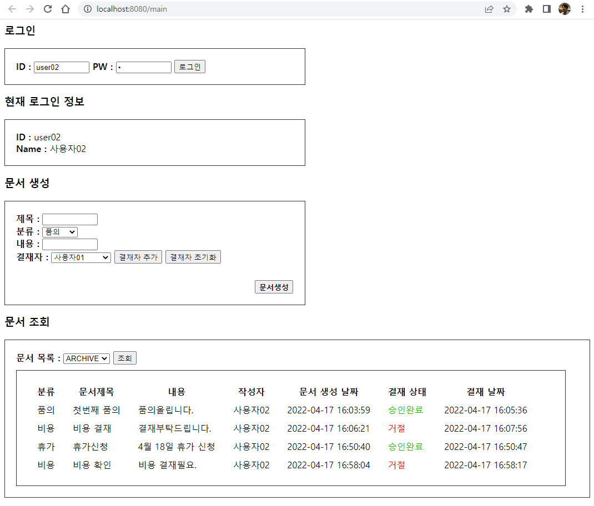

##문서결재 시스템 구현 연습 

### 화면


###테이블 및 기본 데이터 생성 스크립트

```
-- PostgreSQL 11
CREATE SCHEMA chanwoongDB AUTHORIZATION chanwoong;

-- 사용자 테이블
CREATE TABLE chanwoongDB.usertable (
	user_key int4 NOT NULL DEFAULT nextval('user_user_key_seq'::regclass),
	id varchar(45) NULL,
	user_name varchar(128) NULL,
	pw varchar(64) NULL
);

-- 문서 종류 테이블
CREATE TABLE chanwoongDB.document_type (
	type_key serial4 NOT NULL,
	type_name varchar(32) NULL
);

-- 문서 테이블
CREATE TABLE chanwoongDB.documents (
	doc_key int4 NOT NULL DEFAULT nextval('document_doc_key_seq'::regclass),
	doc_type int4 NULL,
	title varchar(64) NULL,
	contents varchar(256) NULL,
	cre_user int4 NULL,
	cre_date timestamp NULL,
	state varchar NULL DEFAULT 'I'::character varying,
	approval_date timestamp NULL
);

-- 결재 관리 테이블
CREATE TABLE chanwoongDB.approval_management (
	idx serial4 NOT NULL,
	doc_key int4 NULL,
	priority int4 NULL,
	approver int4 NULL,
	state varchar(8) NULL DEFAULT 'W'::character varying,
	opinion varchar(256) NULL,
	mod_date timestamp NULL
);

-- 문서, 결재 맵핑테이블
CREATE TABLE chanwoongDB.m_doc_approval (
	doc_key int4 NULL,
	priority_order int4 NULL,
	delete_yn bool NULL
);


-- Default data

-- Document Type
INSERT INTO chanwoongDB.document_type
(type_name)
VALUES('품의');
INSERT INTO chanwoongDB.document_type
(type_name)
VALUES('비용');
INSERT INTO chanwoongDB.document_type
(type_name)
VALUES('휴가');

-- User
INSERT INTO chanwoongDB.usertable
(id, user_name, pw)
VALUES('user01', '사용자01', '1');
INSERT INTO chanwoongDB.usertable
(id, user_name, pw)
VALUES('user02', '사용자02', '1');
INSERT INTO chanwoongDB.usertable
(id, user_name, pw)
VALUES('user03', '사용자03', '1');
INSERT INTO chanwoongDB.usertable
(id, user_name, pw)
VALUES('user04', '사용자04', '1');
INSERT INTO chanwoongDB.usertable
(id, user_name, pw)
VALUES('user05', '사용자05', '1');

```


